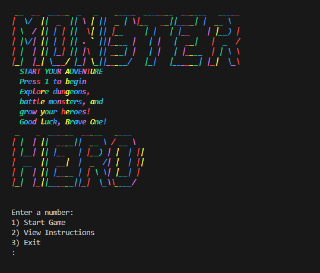
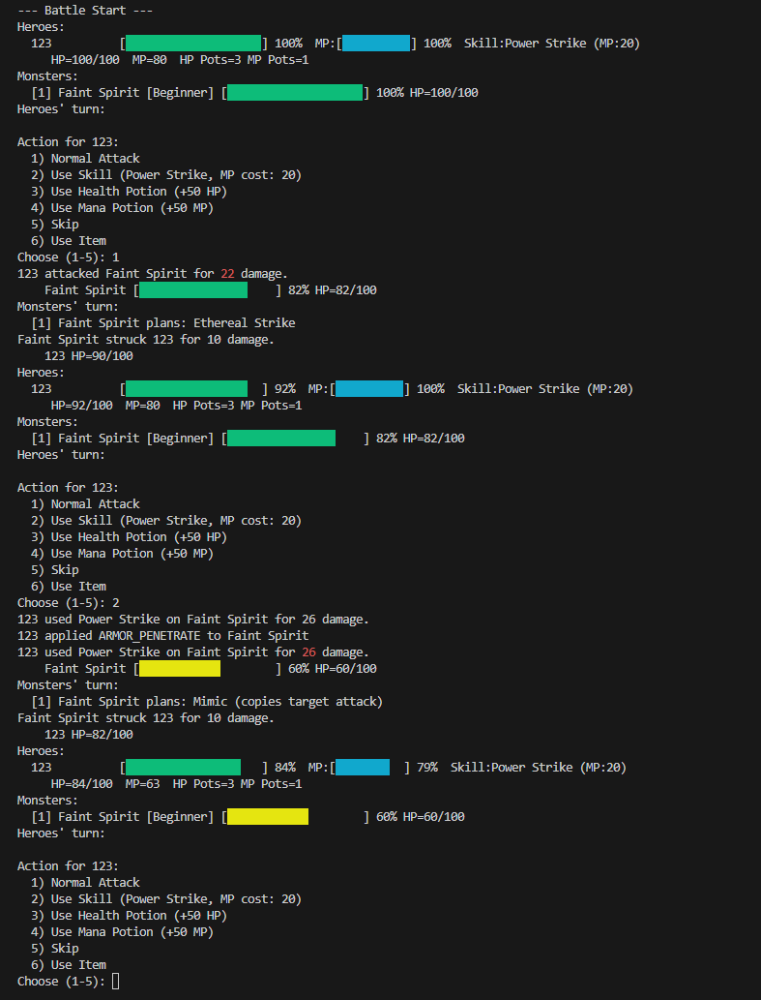
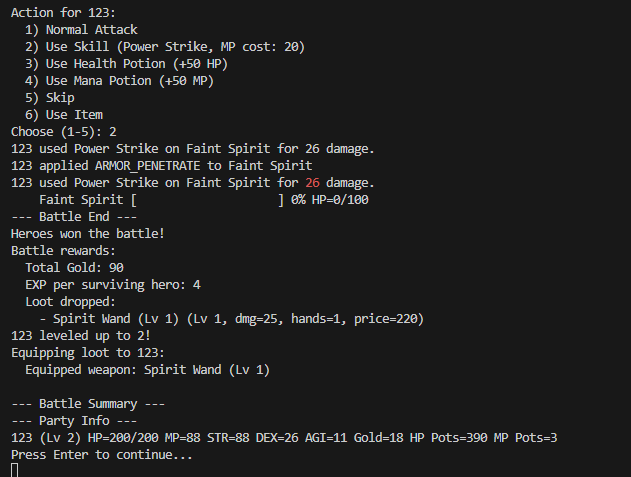
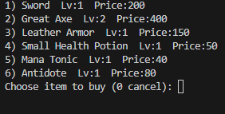
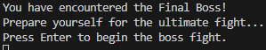
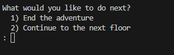
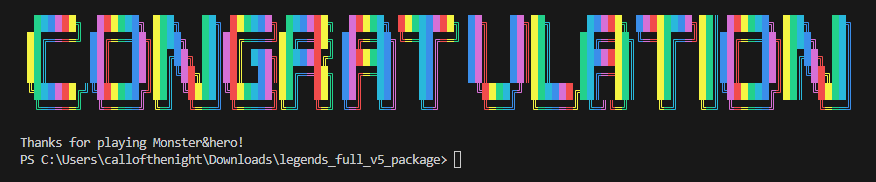

# Monster&Hero: Legends of Valor


## Features

- **Procedural Map Generation**: Dynamic 8x8 tile-based world with danger gradients
- **Turn-Based Combat**: Strategic battles with heroes vs monsters
- **Multi-Hero Party System**: Create and manage 1-3 heroes with distinct classes
- **Random Adventure Events**: Encounter blessings, treasure, or ambushes on your journey
- **Market System**: Buy weapons, armor, and consumables to strengthen your party
- **Save/Load System**: Persistent game state with JSON serialization
- **ANSI Color Display**: Rich terminal colors with visual danger indicators
- **Character Icons & Skill FX**: Unique hero icons plus colorful skill bursts for combat feedback
- **Difficulty Modes**: Easy, Normal, Hard, plus a developer Test mode with instant monster defeats
- **Balanced Progression**: Configurable XP curves and monster scaling
- **Endless Floors**: Continue after boss fights to face refreshed maps and tougher “next floor” bosses

---

## Game Mechanics

### Hero Classes

#### **Warrior**
- High Strength (22) & Agility (16)
- Frontline fighter excelling at physical attacks
- Best for: Close combat, sustained damage

#### **Sorcerer**
- High Dexterity (22) & Agility (18)
- Powerful spellcaster with large mana pool (120 MP)
- Best for: Burst damage, magical attacks

#### **Paladin**
- Balanced Strength (20) & Dexterity (18)
- Versatile holy knight with durability
- Best for: Mixed offense/defense, team stability

### Combat System
- **Turn Order**: Heroes act first, then monsters
- **Actions**: Attack, cast skills, use items, or defend
- **Damage Calculation**: Influenced by stats, equipment, and armor penetration
- **Status Effects**: Buffs and debuffs affecting combat performance
- **Flee Mechanic**: Chance-based escape (depends on party agility and enemy count)

#### Combat Formulas
- Hero normal attack damage: `(strength + weapon_damage) × 0.05`
- Hero spell damage: `spell_base_damage + (dexterity ÷ 10000) × spell_base_damage`
- Hero dodge chance: `agility × 0.002`
- Monster dodge chance: `listed_dodge × 0.01`
- End-of-round recovery: `HP = min(max_HP, ceil(HP × 1.1))`, `MP = min(max_MP, ceil(MP × 1.1))`

### Map & Exploration
- **Tile Types**:
  - **Common (Blue/Cyan/Yellow)**: Explorable terrain with danger gradient
  - **Market (Green)**: Buy equipment and consumables
  - **Inaccessible (Red)**: Blocked tiles
  - **Boss (Magenta)**: Final Boss encounter

- **Danger Gradient**: Tile colors indicate proximity to boss
  - Blue = Safe (far from boss)
  - Cyan = Moderate danger
  - Yellow = High danger (near boss)

---

## Installation & Running

### Compile
```powershell
cd legends_full_v5_src
javac -source 1.8 -target 1.8 -encoding UTF-8 -d out @(Get-ChildItem -Recurse -Filter *.java | ForEach-Object { $_.FullName })
```

### Run
```powershell
java -cp out legends.Main
```

---

## How to Play

### Starting the Game



1. Launch the game - you'll see the ASCII art banner
2. Choose from the menu:
   - **1) Start Game** - Begin new adventure
   - **2) View Instructions** - Learn controls
   - **3) Exit** - Quit game

### Difficulty Selection


Choose your difficulty mode:
- **EASY**: Forgiving encounters tuned for new players
- **NORMAL**: Standard combat challenge
- **HARD**: Stronger monsters and harsher battles
- **TEST**: Developer shortcut; monsters are defeated by any hit
- Icons for each hero class help differentiate party members at a glance
- Heroes recover 10% of their current HP and MP at the end of every combat round, regardless of difficulty

### Party Creation


1. Select number of heroes (1-3)
2. Choose class for each hero:
   - Warrior (physical damage dealer)
   - Sorcerer (magical damage dealer)
   - Paladin (balanced fighter)
3. Enter hero names

### Map Navigation


**Controls**:
- **W/A/S/D** - Move up/left/down/right
- **I** - View detailed party info
- **M** - Enter market (when on green tile)
- **C** - Open catalog (view discovered monsters)
- **V** - Save the current adventure to `save/savegame.json`
- **L** - Load the latest save file immediately
- **Q** - Quit game

**Map Legend**:
- `[H ]` - Your party position (black background)
- `[ $]` - Market (green)
- `[ X]` - Inaccessible (red)
- `[  ]` - Common tiles (blue → cyan → yellow danger gradient)
- `[ B]` - Final Boss (magenta)

**Floor Indicator**:
- Current floor number is shown above the map; higher floors mean tougher encounters and alternate boss positions

### Combat Encounter


When encountering monsters:
1. **View Enemies**: See monster levels and danger indicators
   - Green name = Below your level
   - Yellow name = Equal level
   - Red name = Above your level
2. **Choose Action**:
   - **1) Fight** - Enter combat
   - **2) Attempt to flee** - Escape chance shown
   - **3) Prepare** - Use potions before battle



During battle:
- Select hero actions each turn
- Choose targets for attacks/skills
- Use items to heal or restore mana
- Heroes attack first, then monsters
- Skill activations render colorful ASCII bursts for both heroes and monsters



After victory:
- Heroes fully recover HP/MP
- Gain gold and experience
- Level up if enough XP earned
- View updated party stats

### Random Events


On common tiles, you may encounter special events:
- **Ancient Stone Blessing**: Random stat boost (+1 STR/DEX/AGI)
- **Abandoned Pack**: Find equipment for weakest hero
- **Alchemical Remnants**: Receive health/mana potions
- **Ambush**: Forced combat encounter

### Market



In markets, you can:
- Buy weapons (increase damage)
- Buy armor (increase defense)
- Buy consumables (healing/mana potions)
- Sell equipment or consumables for half their purchase price
- Equip purchased items immediately
- Manage party inventory

### Boss Battle



When reaching the boss tile:
- Face the Final Overlord (scaled to party level + 2 + floor bonus)
- Much tougher than normal monsters
- Victory fully heals your party

**After defeating the boss:**




- **End Adventure**: Print a colorful “congratulation” celebration banner and exit
- **Continue**: Regenerate the map as the next floor, increase monster strength, and spawn a new floor boss in a rotated corner
- Each floor uses a unique boss location (bottom-right → top-left → top-right → bottom-left → repeat)

---

## Game Systems

### Leveling & Progression
- **XP Formula**: `level × 10` XP needed per level
- **XP Rewards**: `number_of_monsters × 2` XP to each surviving hero
- **Gold Rewards**: `sum(monster levels) × 100` gold to each surviving hero
- **Level Up Benefits**:
  - HP resets to `level × 100`
  - MP becomes `ceil(current MP × 1.1)` and max MP increases by 10%
  - All stats gain 5%; favored stats gain an additional 5%

### Monster Scaling
Monsters adapt to party strength:
- Base level: Highest hero level, modified by zone bias and stage effects
- Party size (1-3 heroes) spawns an equal number of monsters
- **Proximity Bias** (distance-based):
  - Near boss (≤3 tiles): +3 level bias
  - Mid distance: +1 level bias
  - Far from boss (≥70% max dist): -2 level bias
- **Floor Modifier**: Each additional floor adds +2 level bias to all encounters

### Equipment System
- **Weapons**: Increase physical damage output
- **Armor**: Reduce incoming damage
- **Consumables**: Restore HP/MP or provide buffs
- Equipment scales with required hero level

### Status Effects
- Applied through skills or special attacks
- Can boost stats or apply debuffs
- Duration-based with turn counters

---

## Difficulty Modes

| Mode   | Hero Regen (per round) | Monster Difficulty | Recommended For |
|--------|------------------------|-------------------|----------------|
| **EASY** | 10% HP & MP | Standard | New players, learning mechanics |
| **NORMAL** | 10% HP & MP | Standard | Balanced challenge |
| **HARD** | 10% HP & MP | Enhanced stats | Experienced players |
| **TEST** | 10% HP & MP | Falls in one hit | Developers, quick battle testing |

**Note**: Heroes always fully recover after winning battles, regardless of difficulty.

---

## Project Structure

```
legends_full_v5_src/
├── legends/                   # Main game package
│   ├── Main.java             # Entry point
│   ├── LegendsGame.java      # Game controller & main loop
│   ├── Config.java           # Balance tuning constants
│   ├── Catalog.java          # Monster encyclopedia
│   ├── CatalogState.java     # Catalog persistence
│   │
│   ├── battle/               # Combat system
│   │   ├── BattleEngine.java # Turn-based combat logic
│   │   └── Fighter.java      # Combat interface
│   │
│   ├── model/                # Game entities
│   │   ├── Hero.java         # Hero base class
│   │   ├── Warrior.java      # Warrior specialization
│   │   ├── Sorcerer.java     # Sorcerer specialization
│   │   ├── Paladin.java      # Paladin specialization
│   │   ├── Monster.java      # Monster base class
│   │   ├── Dragon.java       # Dragon type
│   │   ├── Exoskeleton.java  # Exoskeleton type
│   │   ├── Spirit.java       # Spirit type
│   │   └── FinalBoss.java    # Boss encounter
│   │
│   ├── world/                # Map system
│   │   ├── WorldMap.java     # Map generation & display
│   │   └── TileType.java     # Tile type enum
│   │
│   ├── items/                # Equipment & consumables
│   │   ├── Item.java         # Item base class
│   │   ├── Weapon.java       # Weapon items
│   │   ├── Armor.java        # Armor items
│   │   ├── Accessory.java    # Accessory items
│   │   ├── Consumable.java   # Potion items
│   │   └── ConsumableStack.java # Inventory stacking
│   │
│   ├── skills/               # Hero abilities
│   │   ├── Skill.java        # Skill interface
│   │   ├── DefaultHeroSkill.java # Basic attacks
│   │   ├── DeclarativeSkill.java # Data-driven skills
│   │   ├── SkillRegistry.java    # Skill loader
│   │   └── SimpleJson.java       # JSON parser
│   │
│   ├── events/               # Random events system
│   │   ├── Event.java        # Event base
│   │   ├── EventBus.java     # Event dispatcher
│   │   ├── EventListener.java # Event handlers
│   │   ├── AdventureEvent.java   # Random encounters
│   │   ├── AdventureEventRegistry.java # Event definitions
│   │   ├── OnDamageEvent.java    # Damage events
│   │   ├── OnStatusApplyEvent.java # Status events
│   │   └── OnTurnStartEvent.java  # Turn events
│   │
│   ├── effects/              # Status effects
│   │   └── StatusEffect.java # Buffs/debuffs
│   │
│   ├── io/                   # Input/output abstraction
│   │   ├── IO.java           # IO interface
│   │   ├── ConsoleIO.java    # Terminal IO
│   │   └── HeadlessIO.java   # Testing IO
│   │
│   ├── market/               # Shop system
│   │   └── Market.java       # Market interface
│   │
│   ├── party/                # Party management
│   │   └── Party.java        # Hero group
│   │
│   ├── factory/              # Object creation
│   │   ├── MonsterFactory.java   # Monster instantiation
│   │   └── MonsterRegistry.java  # Monster definitions
│   │
│   ├── util/                 # Utilities
│   │   └── SaveLoad.java     # Save/load system
│   │
│   ├── BattleSmokeTest.java # Automated battle test
│   └── BattleMultiHeroTest.java # Multi-hero test
│
├── data/                     # Game data files
│   ├── monsters.txt          # Monster definitions
│   └── skills.json           # Skill definitions
│
├── out/                      # Compiled classes
└── save/                     # Save game directory
    └── savegame.json         # Persistent game state
```

---

## Configuration & Tuning

All game balance parameters are centralized in `legends/Config.java`:

### Experience & Leveling
```java
XP_PER_LEVEL_FACTOR = 10;     // XP needed = level × 10
XP_REWARD_MULTIPLIER = 2;     // Legacy multiplier (battle XP now fixed at monsters × 2)
```

### Monster Spawning
```java
MONSTER_BIAS_NEAR = 3;         // +3 levels near boss
MONSTER_BIAS_MID = 1;          // +1 levels mid-range
MONSTER_BIAS_FAR = -2;         // -2 levels far from boss
MONSTER_BIAS_NEAR_DISTANCE = 3; // "Near" = ≤3 tiles
```

### Map Display
```java
DANGER_THRESHOLD_LOW = 0.25;   // Blue → Cyan transition
DANGER_THRESHOLD_HIGH = 0.75;  // Cyan → Yellow transition
```

### Random Events
```java
RANDOM_EVENT_CHANCE = 0.15;    // 15% event chance on common tiles
POST_EVENT_BATTLE_CHANCE = 0.30; // 30% battle after non-combat event
```

### Difficulty
```java
DIFFICULTY = "NORMAL";         // "EASY", "NORMAL", or "HARD"
```

---

## Save System

### Save File Location
`save/savegame.json`

### What Gets Saved
- Party position on map
- All hero stats (HP, MP, level, XP, gold)
- Hero equipment (weapons, armor)
- Hero inventory (consumables)
- Catalog unlocked entries (discovered monsters)

### How to Save / Load
- Press `V` on the map screen to write a manual save to disk
- Press `L` on the map screen to load `save/savegame.json` (overwrites current session)
- The map prompt always reminds you of the `V=Save / L=Load` shortcuts

### Save Format (JSON)
```json
{
  "row": 2,
  "col": 3,
  "heroes": [
    {
      "name": "Arthas",
      "class": "Warrior",
      "level": 5,
      "hp": 500,
      "maxHp": 500,
      "mp": 95,
      "maxMp": 95,
      "strength": 28,
      "dexterity": 12,
      "agility": 20,
      "gold": 1250,
      "exp": 8,
      "weapon": "Iron Sword +2",
      "armor": "Chainmail",
      "consumables": [...]
    }
  ],
  "catalogUnlocked": ["Dragon", "Exoskeleton", "Spirit"]
}
```

---

## Development

### Compilation
```powershell
# Compile with Java 8 compatibility
javac -source 1.8 -target 1.8 -encoding UTF-8 -d out @(Get-ChildItem -Recurse -Filter *.java | ForEach-Object { $_.FullName })
```

### Testing
```powershell
# Run smoke test (single hero)
java -cp out legends.BattleSmokeTest

# Run multi-hero test (3 heroes)
java -cp out legends.BattleMultiHeroTest
```

### Code Architecture

**Design Patterns Used**:
- **MVC**: `LegendsGame` (Controller), `WorldMap` (Model), Console output (View)
- **Factory**: `MonsterFactory`, `MonsterRegistry` for object creation
- **Strategy**: `IO` interface with `ConsoleIO`/`HeadlessIO` implementations
- **Observer**: `EventBus` for game events
- **Singleton**: `EventBus`, `Config` (utility class)

**Key Abstractions**:
- `Fighter` interface: Common combat operations
- `IO` interface: Platform-independent input/output
- `Skill` interface: Extensible ability system
- `Event` classes: Decoupled game events

### Adding New Content

#### New Hero Class
1. Extend `Hero.java`
2. Override `getFavoredStatMultiplier()`
3. Add factory method in `Hero.createXXX()`
4. Update party creation in `LegendsGame`

#### New Monster Type
1. Extend `Monster.java`
2. Add entry in `data/monsters.txt`
3. Register in `MonsterRegistry`

#### New Adventure Event
1. Create `AdventureEvent` instance in `AdventureEventRegistry`
2. Define effect logic with `Effect` interface
3. Set narrative text and combat flag

#### New Skill
1. Add definition to `data/skills.json`
2. Define effect type (damage, heal, buff, etc.)
3. `SkillRegistry` auto-loads on startup

---

### Save/Load System


---

## Developer Reflection

Looking back on this project, I often found myself completely stuck on a subsystem, only to grind through the problem by returning to fundamentals, revisiting lecture notes, and experimenting until something finally clicked. Seeing each feature come to life through that mix of struggle and discovery has been incredibly fulfilling. Aside from the remaining work on balance tuning, the rest of the game now feels whole. I’m deeply grateful for the patience and dedication of my professor and TAs—their support made it possible to keep going.
